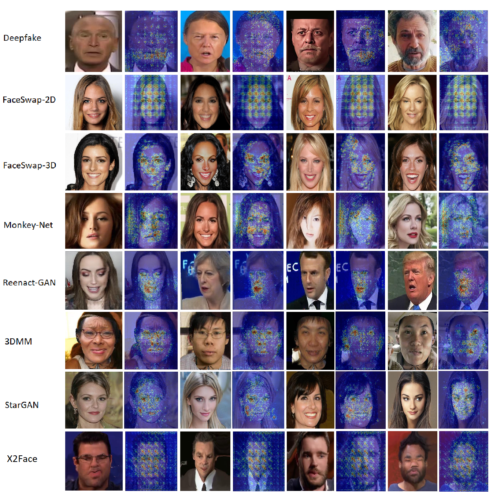
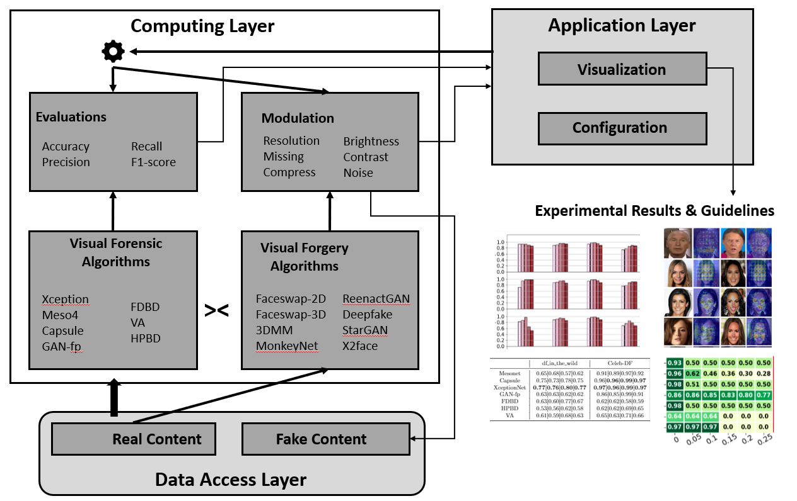

# A War BeyondDeepfake: Benchmarking Facial Counterfeits andCountermeasures
[](https://arxiv.org/abs/2111.12912)



This is the official implementation of 
>Pham, M.T., Huynh, T.T., Tong, V.V., Nguyen, T.T., Nguyen, T.T., Yin, H. and Nguyen, Q.V.H., 2021. A dual benchmarking study of facial forgery and facial forensics. arXiv preprint arXiv:2111.12912.

## Citation

```
@article{pham2021dual,
  title={A dual benchmarking study of facial forgery and facial forensics},
  author={Pham, Minh Tam and Huynh, Thanh Trung and Tong, Van Vinh and Nguyen, Thanh Tam and Nguyen, Thanh Thi and Yin, Hongzhi and Nguyen, Quoc Viet Hung},
  journal={arXiv preprint arXiv:2111.12912},
  year={2021}
}
```

## Abstract
In recent years, visual forgery has reached a level of sophistication that humans cannot identify fraud, which poses a significant threat to information security. A wide range of malicious applications have emerged, such as fake news, defamation or blackmailing of celebrities, impersonation of politicians in political warfare, and the spreading of rumours to attract views. As a result, a rich body of visual forensic techniques has been proposed in an attempt to stop this dangerous trend. In this paper, we present a benchmark that provides in-depth insights into visual forgery and visual forensics, using a comprehensive and empirical approach. More specifically, we develop an independent framework that integrates state-of-the-arts counterfeit generators and detectors, and measure the performance of these techniques using various criteria. We also perform an exhaustive analysis of the benchmarking results, to determine the characteristics of the methods that serve as a comparative reference in this never-ending war between measures and countermeasures. 

## Framework
When developing our dual benchmarking analysis of visual forgery and visual forensic techniques, we aimed to provide an extensible framework. To achieve this goal, we used a component-based design to integrate the techniques in a straightforward manner while maintaining their original performance. The below figure depicts the simplified architecture of the framework. The framework contains three layers. The first is a data access layer, which organises the underlying data objects, including the genuine and forged content generated by the visual forgery techniques. The second is a computing layer, which contains four modules: the visual forgery, visual forensics, modulation and evaluation modules. The visual forgery and visual forensics modules include the generation algorithms and forgery detection techniques, respectively. Both of these modules allow the user to easily integrate new algorithms for benchmarking. The modulation module uses a specified configuration to augment the content in order to validate different adverse conditions such as brightness and contrast. The evaluation module assesses the prediction results from the visual forensics module based on various metrics, and delivers statistics and findings to the application layer. Finally, users interact with the framework via the application layer to configure parameters and receive output visualisations.




## Enviroment
``` pip install -r requirement.txt``` 


## Preprocess data
Extract fame from video and detect face in frame to save *.jpg image.

```
python extrac_face.py --inp in/ --output out/ --worker 1 --duration 4
```

`--inp` : folder contain video

`--output` : folder output .jpg image 

`--worker`  : number thread extract

`--duration` : number of frame skip each extract time

## Train
Preprocess for GAN-fingerprint

```
python data_preparation_gan.py in_dir /hdd/tam/df_in_the_wild/image/train --out_dir /hdd/tam/df_in_the_wild/gan/train resolution 128
```

Preprocess for visual model

```
python -m feature_model.visual_artifact.process_data --input_real /hdd/tam/df_in_the_wild/image/train/0_real --input_fake /hdd/tam/df_in_the_wild/image/train/1_df --output /hdd/tam/df_in_the_wild/train_visual.pkl --number_iter 1000
```

Preprocess for headpose model

```
python -m feature_model.headpose_forensic.process_data --input_real /hdd/tam/df_in_the_wild/image/train/0_real --input_fake /hdd/tam/df_in_the_wild/image/train/1_df --output /hdd/tam/df_in_the_wild/train_visual.pkl --number_iter 1000
```

Preprocess for spectrum 

```
python -m feature_model.spectrum.process_data --input_real /hdd/tam/df_in_the_wild/image/train/0_real --input_fake /hdd/tam/df_in_the_wild/image/train/1_df --output /hdd/tam/df_in_the_wild/train_spectrum.pkl --number_iter 1000
```


## Train

Train for cnn 

```
python train.py --train_set data/Celeb-DF/image/train/ --val_set data/Celeb-DF/image/test/ --batch_size 32 --image_size 128 --workers 16 --checkpoint xception_128_df_inthewild_checkpoint/ --gpu_id 0 --resume model_pytorch_1.pt --print_every 10000000 xception_torch
```

Train for feature model

```
python train.py --train_set /hdd/tam/df_in_the_wild/train_visual.pkl   --checkpoint spectrum_128_df_inthewild_checkpoint/ --gpu_id 0 --resume model_pytorch_1.pt spectrum
```


## Eval

Eval for cnn

```
python eval.py  --val_set /hdd/tam/df_in_the_wild/image/test/ --adj_brightness 1.0 --adj_contrast 1.0 --batch_size 32 --image_size 128 --workers 16 --checkpoint efficientdual_128_df_inthewild_checkpoint/ --resume model_dualpytorch3_1.pt efficientdual
```

```
python eval.py  --val_set /hdd/tam/df_in_the_wild/image/test/ --adj_brightness 1.0 --adj_contrast 1.5 --batch_size 32 --image_size 128 --workers 16 --checkpoint capsule_128_df_inthewild_checkpoint/ --resume 4 capsule
```

Eval for feature model

```
python eval.py --val_set ../DeepFakeDetection/Experiments_DeepFakeDetection/test_dfinthewild.pkl   --checkpoint ../DeepFakeDetection/Experiments_DeepFakeDetection/model_df_inthewild.pkl --resume model_df_inthewild.pkl spectrum
```

## Detect

```
python detect_img.py --img_path /hdd/tam/extend_data/image/test/1_df/reference_0_113.jpg --model_path efficientdual_mydata_checkpoint/model_dualpytorch3_1.pt --gpu_id 0 efficientdual
```

```
python detect_img.py --img_path /hdd/tam/extend_data/image/test/1_df/reference_0_113.jpg --model_path xception_mydata_checkpoint/model_pytorch_0.pt --gpu_id 0 xception_torch
```

```
python detect_img.py --img_path /hdd/tam/extend_data/image/test/1_df/reference_0_113.jpg --model_path capsule_mydata_checkpoint/capsule_1.pt  --gpu_id 0 capsule
```

## References
[1] https://github.com/nii-yamagishilab/Capsule-Forensics-v2

[2] Nguyen, H. H., Yamagishi, J., & Echizen, I. (2019). Capsule-forensics: Using Capsule Networks to Detect Forged Images and Videos. ICASSP, IEEE International Conference on Acoustics, Speech and Signal Processing - Proceedings, 2019-May, 2307–2311.

[3] https://github.com/PeterWang512/FALdetector

[4] Wang, S.-Y., Wang, O., Owens, A., Zhang, R., & Efros, A. A. (2019). Detecting Photoshopped Faces by Scripting Photoshop.

[5] Rössler, A., Cozzolino, D., Verdoliva, L., Riess, C., Thies, J., & Nießner, M. (2019). FaceForensics++: Learning to Detect Manipulated Facial Images. 

[6] Hsu, C.-C., Zhuang, Y.-X., & Lee, C.-Y. (2020). Deep Fake Image Detection Based on Pairwise Learning. Applied Sciences, 10(1), 370. 

[7] Afchar, D., Nozick, V., Yamagishi, J., & Echizen, I. (2019). MesoNet: A compact facial video forgery detection network. 10th IEEE International Workshop on Information Forensics and Security, WIFS 2018. 

[8] https://github.com/DariusAf/MesoNet

[9] Li, Y., Yang, X., Sun, P., Qi, H., & Lyu, S. (2019). Celeb-DF: A New Dataset for DeepFake Forensics.

[10] https://github.com/deepfakeinthewild/deepfake_in_the_wild

[11] https://www.idiap.ch/dataset/deepfaketimit

[12] Y. Li, X. Yang, P. Sun, H. Qi, and S. Lyu, “Celeb-DF (v2): A new
dataset for deepfake forensics,” arXiv preprint arXiv:1909.12962v3, 2018.

[13] Neves, J. C., Tolosana, R., Vera-Rodriguez, R., Lopes, V., & Proença, H. (2019). Real or Fake? Spoofing State-Of-The-Art Face Synthesis Detection Systems. 13(9), 1–8.

[14] https://github.com/danmohaha/DSP-FWA


